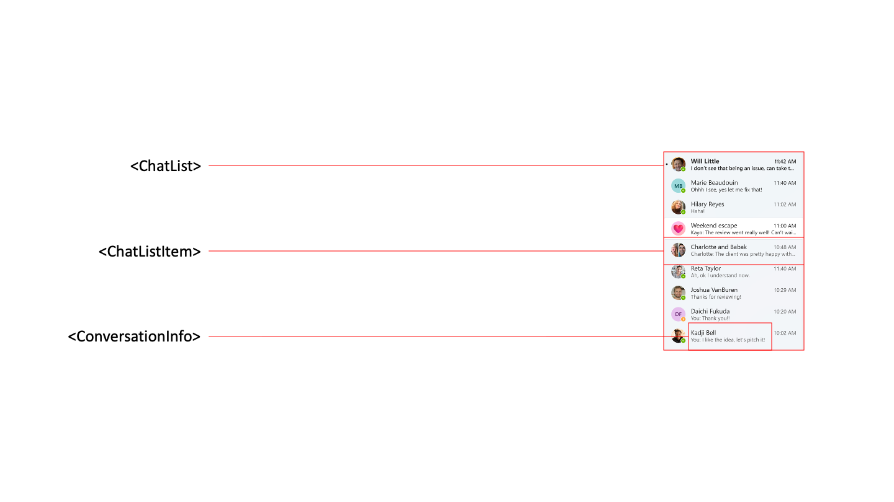
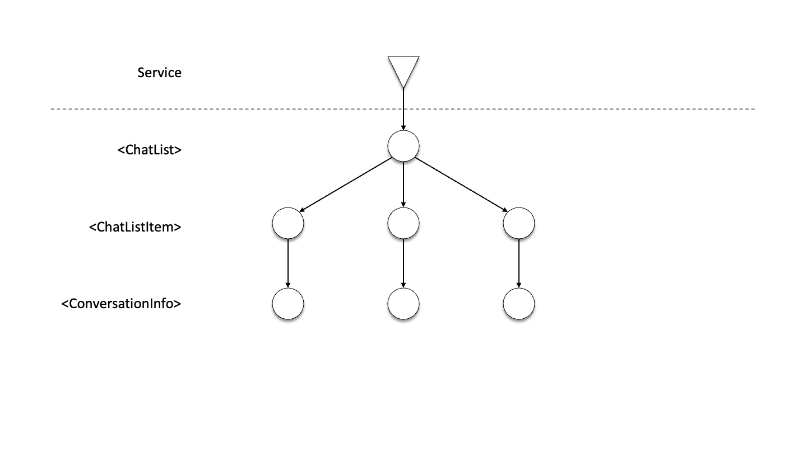
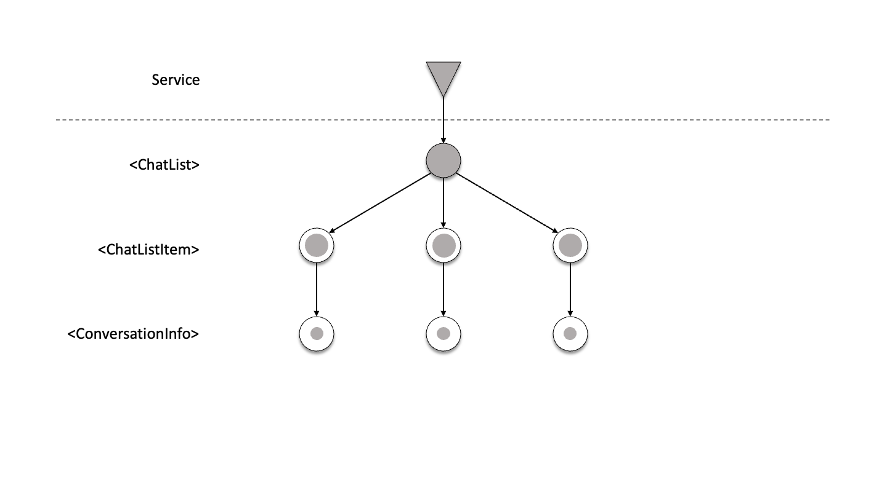
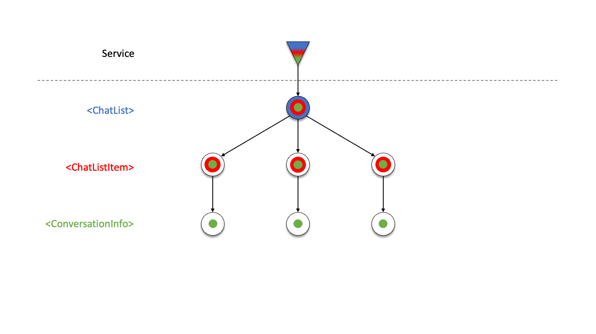
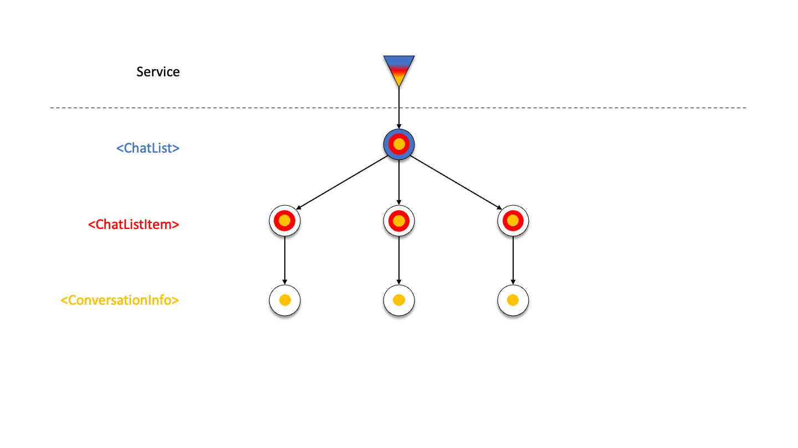
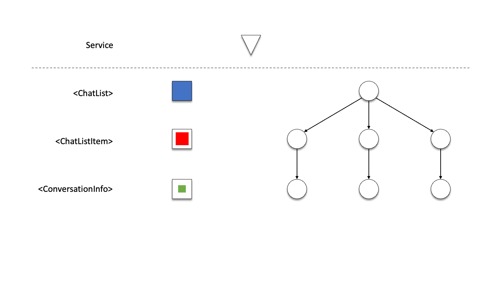
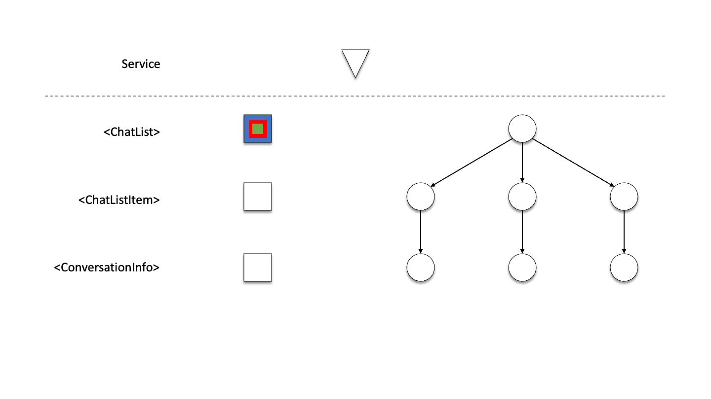
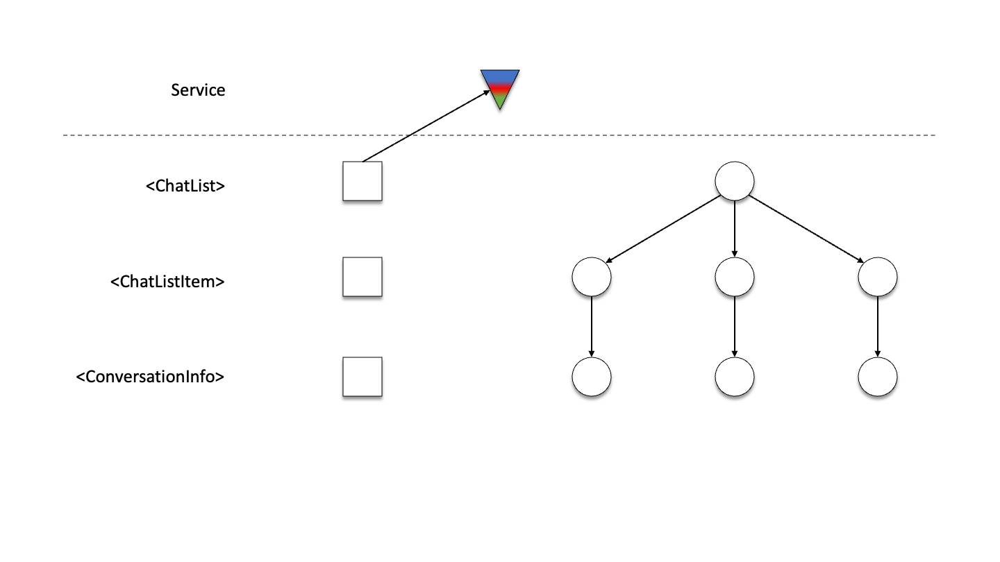

# The design of GraphQL

Unfortunately, the community has largely lost sight of the original design considerations that Facebook had for GraphQL. Key components of its design are misunderstood and often entirely ignored by popular GraphQL clients. Facebook’s own GraphQL client, [Relay](https://relay.dev), incorporates all the GraphQL best-practices learned from using GraphQL _as it was designed_, but alas the choice was made to separate the strong opinions of how to use GraphQL from GraphQL’s own documentation to avoid being prescriptive.

:::danger
Any GraphQL client for data-driven UI applications that does **not** have a strong opinion on making “fragments” the unit around which the user-interface components are built, is **not** leveraging key GraphQL design components nor setting you up for success with complex data-driven UI applications.
:::

With that in mind, forget what you might already know about GraphQL for a bit and let’s go back to when Facebook designed GraphQL—when they had realized that user-interfaces and the back-end services backing them would end up getting coupled together, making iterating on complex applications like theirs extremely hard.

## Example

Let’s take a look at the `ChatList` component of Teams. There’s a list of conversations, content preview, and some details about the participants. So if we would structure this, there would be 3 major components.

- There’s going to be the outer `ChatList` component.
- The `ChatList` component would contain many `ChatListItem` components, one for each conversation that the user has.
- And for each conversation we render some `ConversationInfo`.



So our application looks something like this. We have our tree of components on the client-side, and we have our service endpoint.



The service sends some data down to the client, `ChatList` passes it on to its children, and we populate the data further down through the tree.



## Problem

But of course this is a simplification, what happens when we add some color to this? The `ChatList` component needs an item count, the `ChatListItem` component needs an avatar, and the `ConversationInfo` needs a title and last message preview.

If we look at what’s actually happening here, we’ve encoded the implementation details of all 3 of our components on the service-side, so it knows what data to pass down.
Furthermore, if we look at `ConversationInfo`, we have actually leaked its details into `ChatListItem`, because it has to know what to pass down as props.



So what happens when we change `ConversationInfo`? Well, we’re not just changing `ConversationInfo`, we’re also changing `ChatListItem` and what it passes down. We might have to change `ChatList`, dependending on how it structured things. And we _certainly_ have to change the service, so that it sends the new information.



How did we get here? How did we get to a place where making a simple change to `ConversationInfo`, required us not just to touch that component, but to touch its parents—which are potentially many, in a complex application—and to touch the service?

The big problem was a lack of modularity. We wanted `ConversationInfo` to be a self-contained component, but it wasn’t. Its implementation details were leaked to `ChatListItem`, _and_ up to the service. The thing that was missing was a way for `ConversationInfo` and other components to specify what data they require. That specification didn’t live in the component itself, it was spread all over the application.

## The Solution

What we want is some way for each component to statically define its data needs in a simple way.



And if it can do so in a way that each of its parents can gather up those data needs…


…we can gather up the data requirements _all_ the way up the stack to the root.



The root component can then communicate that up to the service. And instead of the service having these data requirements hardcoded, the service can use this aggregated data specification to decide what data to send back to the client.



From here on out, it’s exactly the same diagram as before. We have a service, the service has the data that our application needs, it sends it to `ChatList`, `ChatList` passes it down to the children, and so forth.


It’s a subtle change, but a _key_ one.

We’ve taken the details about what data `ConversationInfo` requires _out_ of the service, where it doesn’t belong, and have put it _in_ the `ConversationInfo` component where it does.

Because inherently, our rendering logic for `ConversationInfo` and its data-specifications are tied together. We can’t change one without changing the other. So having them both be in the same component makes life a lot easier.

So if we want to do this, if we want each component to be able to specify its own data needs, how can we do so? The realization is that our data-specification has a key property that it needs to fulfill, which is composition.

### Composition

Composition in GraphQL is achieved by leveraging fragments, which are snippets of a query that can be composed together to form larger queries. These fragments are colocated with their components and composed into a tree that very much follows the shape of the component tree.

```tsx
function ChatList() {
  const data = useLazyLoadQuery(
    graphql`
      query ChatListQuery {
        conversations {
          id
          ...ChatListItemFragment
        }
      }
    `,
  );
  return (
    <ul>
      {data.conversations.map((conversation) => (
        <ChatListItem conversation={conversation} key={conversation.id} />
      ))}
    </ul>
  );
}
```

```tsx
function ChatListItem(props) {
  const conversation = useFragment(
    graphql`
      fragment ChatListItemFragment on Conversation {
        lastMessage {
          arrivalTime
          ...ConversationInfoFragment
        }
      }
    `,
    props.conversation,
  );
  return (
    <li>
      <ConversationInfo conversation={conversation} />
      <span>{conversation.lastMessage.arrivalTime}</span>
    </li>
  );
}
```

```tsx
function ConversationInfo(props) {
  const conversation = useFragment(
    graphql`
      fragment ConversationInfoFragment on Conversation {
        title
        lastMessage {
          preview
        }
      }
    `,
    props.conversation,
  );
  return (
    <div>
      <h2>{conversation.title}</h2>
      <p>{conversation.lastMessage.preview}</p>
    </div>
  );
}
```

### Local Reasoning

Because a component and its data requirements are self-contained:

- Engineers don’t need to jump around the codebase
- Engineers can safely cleanup data requirements
- Isolated components can be re-composed into new features
- Isolated components provide improved developer-experience

### Global Optimization

At the framework level, transperantly to the UI engineer, we can:

- Use tooling to extract and optimize query
- Fetch data in single request for a single render pass
- Start fetching data _before_ rendering. For instance at application launch, or when hovering over/near an element
- Leverage component fragments for narrow store observables, to avoid unnecessary re-rendering of ancestor/sibling components
- Couple lazy asset loading to data resolving, including the required components themselves
- Move extracted queries upstream so the pipeline can ahead-of-time optimize/prepare data in a generic manner across builds

## Takeaways

- GraphQL was created to allow composition of data-requirements for UI components in complex data-driven applications.
  - Smaller network payloads is great, but not the primary design goal.
- Fragments are the manner in which a component's unique data-requirements can be composed.
  - They are not meant simply for DRY purposes, nor should they be shared by different components.
